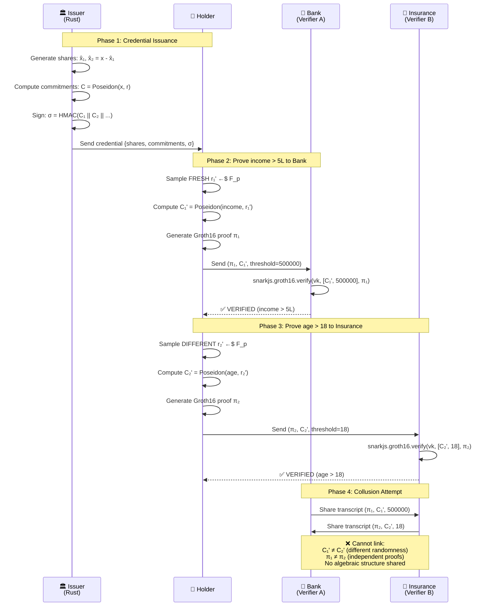
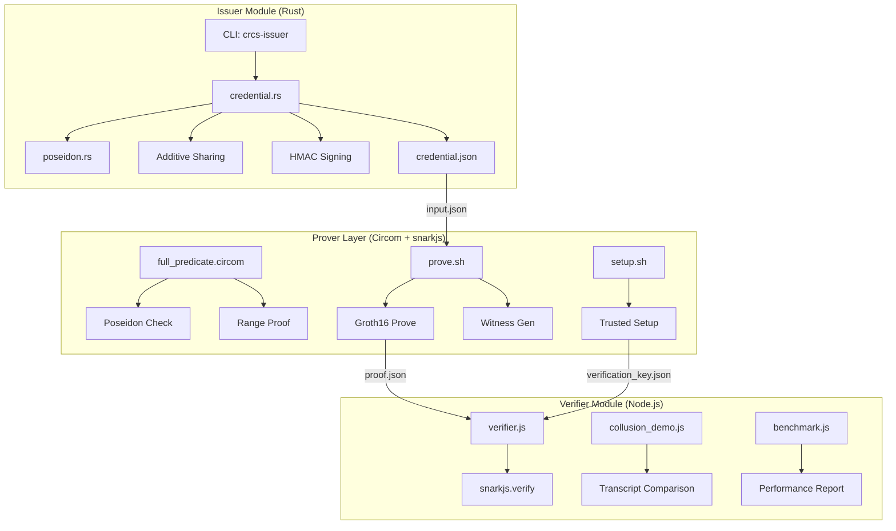
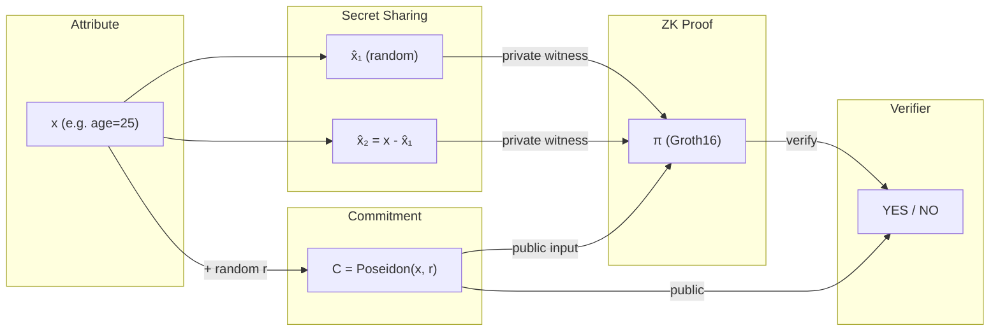

# CRCS Architecture Diagram (Mermaid)

Use this as a starting point. Export to a proper diagram tool like draw.io or Excalidraw for the final submission.

## Full System Flow

## Component Architecture

## Credential Data Flow

